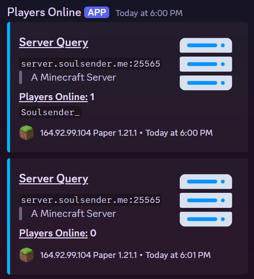

# mc-query
A simple python app that will continuously check a server for users leaving or joining. It will then send parse and send that data via webhook to a discord channel of your choice.

### Setup
Install docker and [docker-compose](https://docs.docker.com/compose/install/).

Download the `docker-compose.yml` file to a directory of your choosing.

Edit the `SERVER` and `WEBHOOK_URL` variables in the `docker-compose.yml` file with the IP or hostname (and port optionally) of your minecraft server, and then the URL of your [discord webhook](https://support.discord.com/hc/en-us/articles/228383668-Intro-to-Webhooks).
> No spaces or quotation marks should be used!

Start the container with:
```sh
docker-compose up -d
```
Now whenever someone joins or leaves your server, a discord webhook will be sent to inform users about the server activity!

